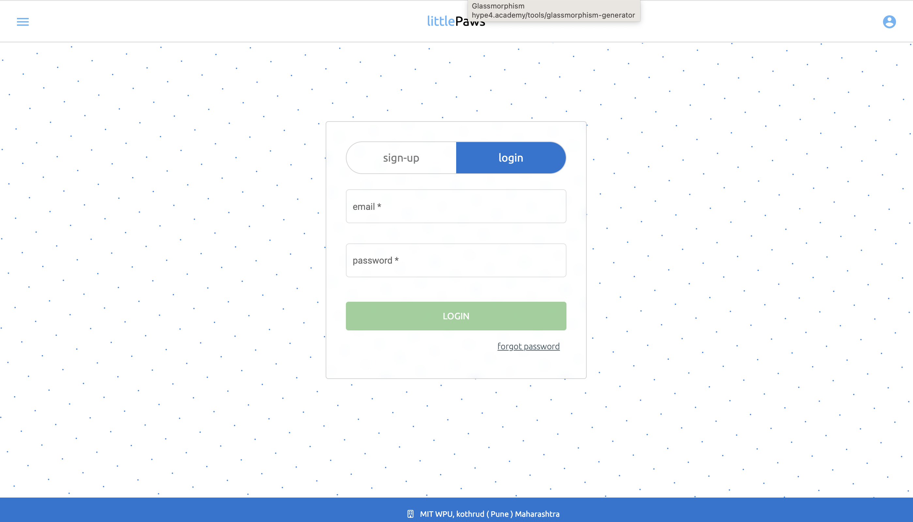
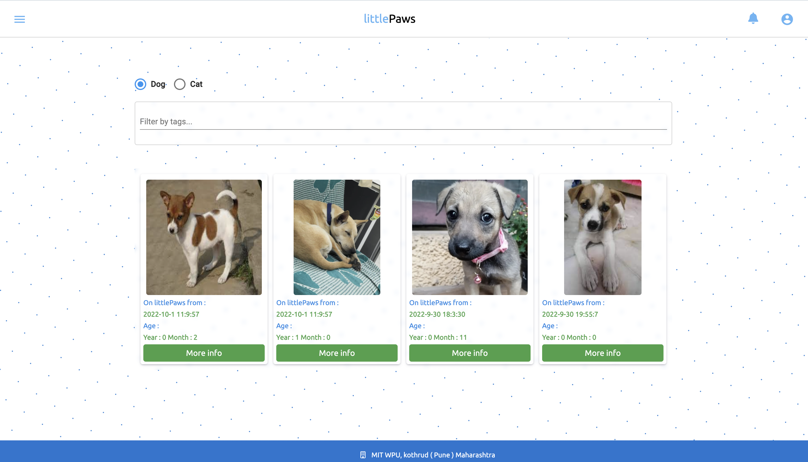
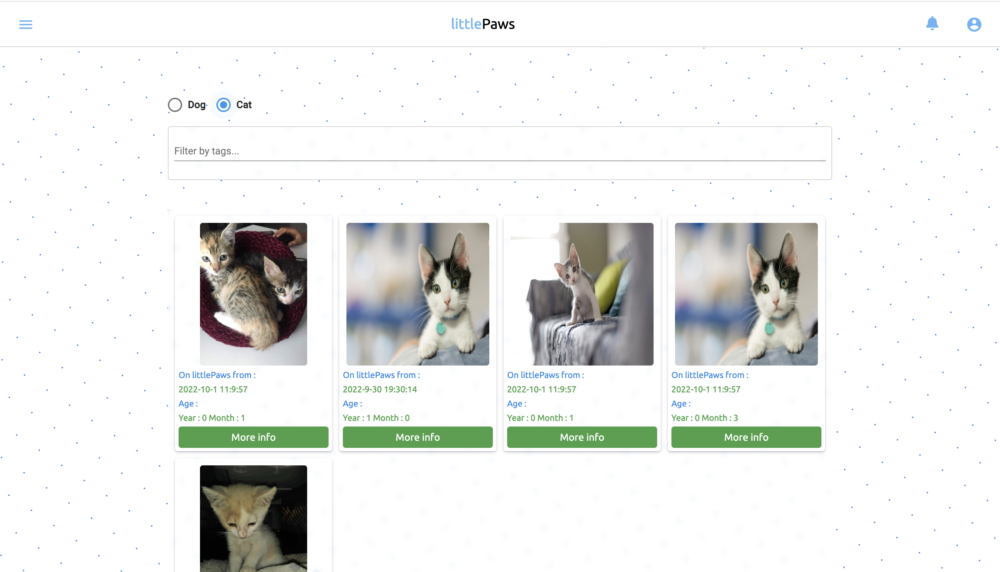
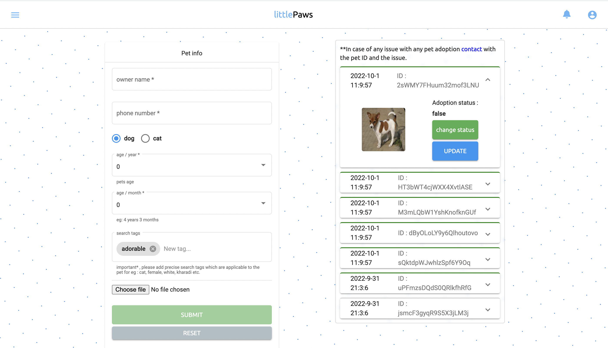
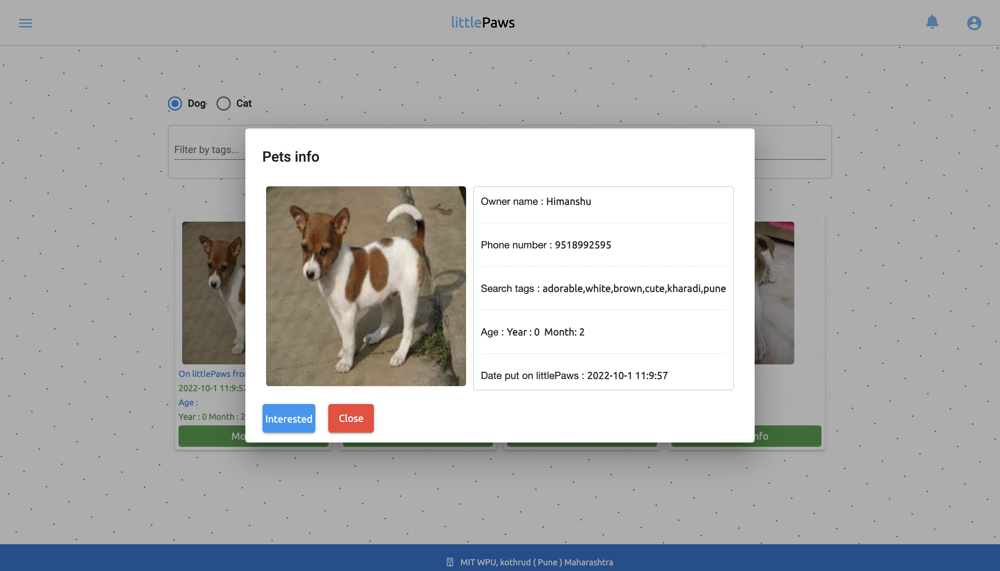
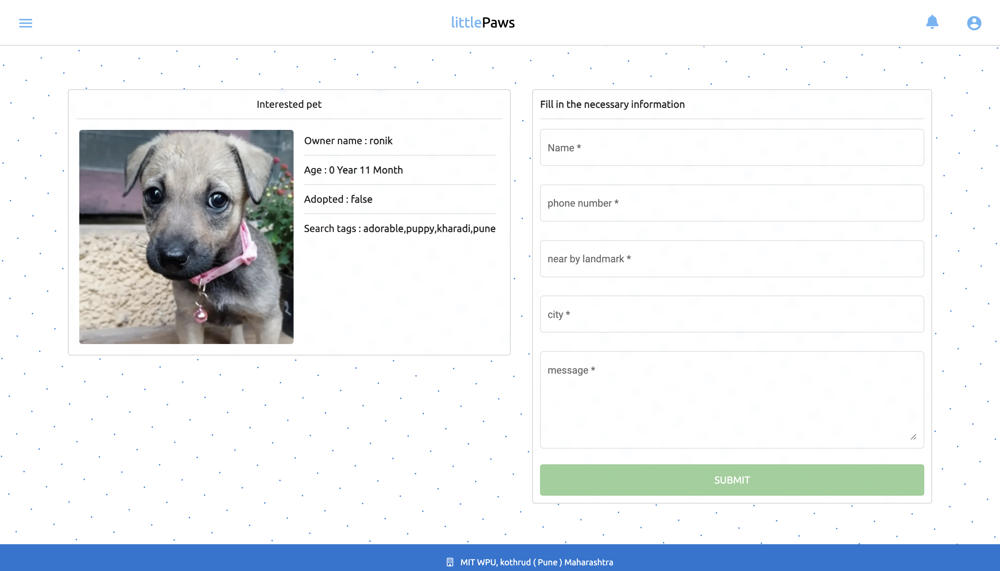
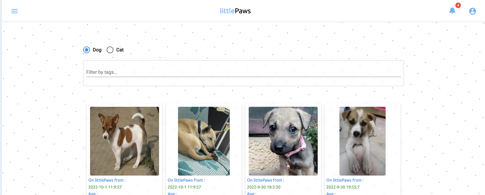
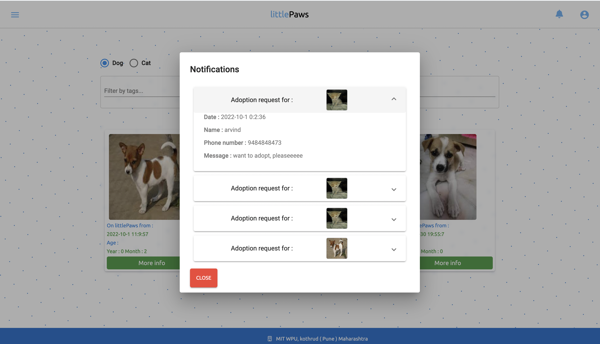
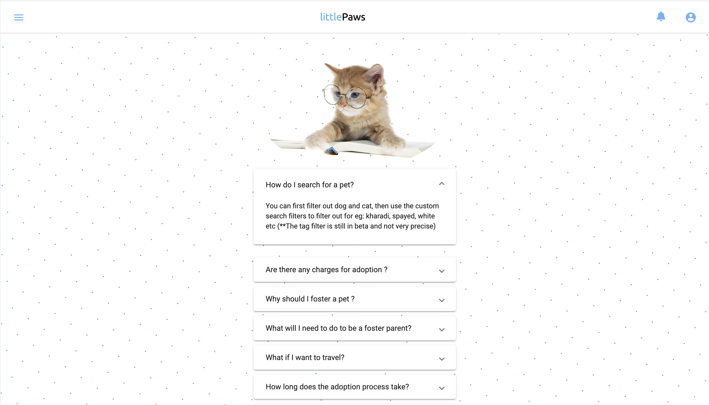

# LittlePaws1.1

# LittePaws 

## A animal adoption platform ( in progress ) 
** _In progress (85-90% completed)_

## I know your first question, how it's different from available platforms ?
- Not much to be honest 
- it's like amazon / flipkart / myntra / ajio etc..
- different platforms same goal, sell products
- But with different UI/UX, and some specific goals in mind.
- User Friendly.

- Simply put, littlePaws is  straight-forward to use with modern concept like search by tags.
  - For eg : Users can filter-out animals by just usings tags like - cat, white, kharadi, pune etc.
  - based on the tags the list will be filtered out and user can proceed further.
 
    
    
** Present, The data is static(ly) put in global variables which will be done to dynamic 
   with express.js, redux & mongoDB.
